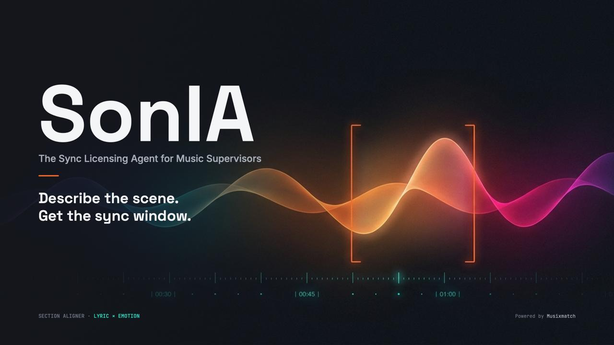
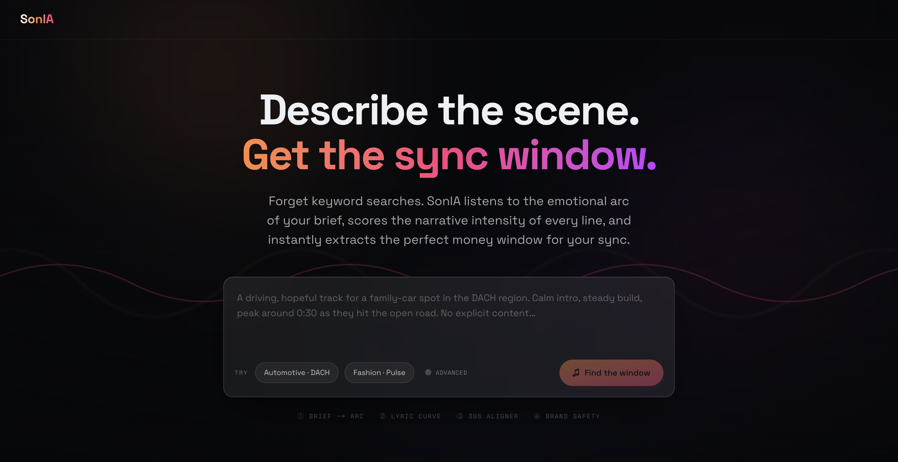
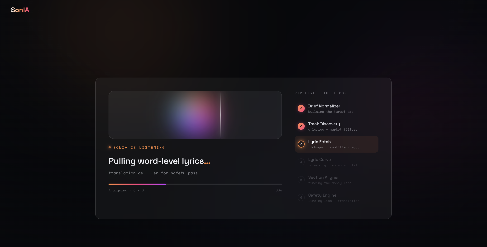
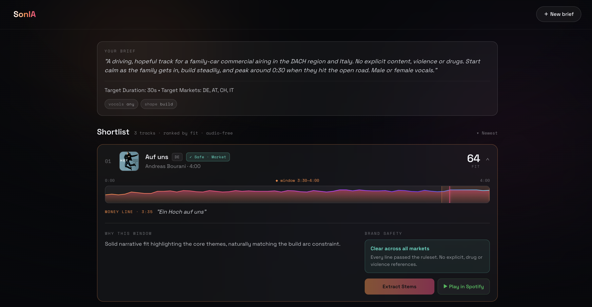

<div align="center">
  
  <h1>SonIA — The Sync Licensing Agent for Music Supervisors</h1>
  <p><em>"Brief in. Shortlist out. The right thirty seconds, found."</em></p>
  <p>Built for the <b>Musixmatch Musicathon 2026</b>.</p>
</div>

---

SonIA is an AI agent that turns a creative brief into a defensible, ranked shortlist of sync candidates — and, for each track, pinpoints the exact ~30-second window and the single "money line" that delivers the brief's emotional arc. It is built for the people who place music against picture: music supervisors, sync agents, and the brand and agency teams who commission them.

The name comes from **SON** (*suono* — sound) and **IA** (the Italian abbreviation for artificial intelligence). SonIA is not a chatbot. She behaves like a competent, concise colleague who already knows the catalogue.



## The problem

Sync licensing is a needle-drop business that still runs on memory and gut feel. A supervisor receives a brief — "warm, nostalgic, builds to a hopeful release at the thirty-second mark, nothing on the nose" — and answers it by recalling tracks they happen to know, then auditioning them by ear against a rough cut. The work is slow, unscalable, and invisible: there is no record of *why* a track was chosen, and no way to interrogate a catalogue at the level that actually matters for sync, which is **the section, not the song**.

A four-minute track is not a sync candidate. A specific eight-bar lift inside it is. Existing search tools index songs by mood, genre and BPM at the *track* level, which is exactly the wrong granularity. They tell you a song is "uplifting". They cannot tell you that the uplift lands at 0:48, that it resolves on the line you'd want under the hero shot, or that the first thirty seconds are too sparse for the brief.

SonIA closes that gap.

---

## The hero feature: the Section Aligner

The Section Aligner is what makes SonIA defensible, and it is built directly on Musixmatch.

It cross-references two time-aligned signals and finds where they agree:

1. **Lyrical structure and meaning over time**, from Musixmatch's synchronised lyrics — word- and line-level timestamps via `track.richsync.get` and `track.subtitle.get`. This is what lets SonIA know *which words land when*.
2. **The emotional contour over time**, from Cyanite's segment-level analysis, which describes how a track's emotion evolves across its duration rather than collapsing it into one tag.

Given a brief's target emotional arc, the Aligner scans each candidate, locates the **optimal ~30-second window** where the emotional curve best matches the brief, and surfaces the **money line** — the lyric that falls at the peak of that window. The output is not "here are some sad songs". It is: *"Bars 17–24, 0:46–1:14, emotion rising from contemplative to hopeful, money line lands at 1:02."*

This is the difference between a search engine and a working tool. A supervisor can hand the result to a director and say exactly why it works, with the timestamp to prove it.

**Design principle — *il dato è la decorazione* ("the data is the decoration").** Every coloured or animated element in the interface derives from a real signal: the emotional spectrum gradient is Cyanite's curve, the highlighted line is a real Musixmatch timestamp, the match score is a real computation. Nothing is invented for effect. What you see is the evidence.



---

## How it works

```text
Brief  ──►  AI Normalizer  ──►  Multi-Source Retrieval  ──►  Vibe Check & Safety  ──►  Section Aligner  ──►  Ranked Shortlist
                                           │                          │                        │
                    Musixmatch Semantic ───┤           Musixmatch Mood ──┤      Musixmatch Sync ───┤
                    Cyanite Audio Search ──┼           Spotify Features ─┘      Claude Lyric AI ───┤
                    Claude Hit-Maker ──────┘                                    Cyanite Curve ─────┘
```

1. **Intake.** The supervisor describes the spot in natural language — mood, arc, target moment, brand-safety constraints, do's and don't's. Claude (our "Fable" AI) normalizes this brief, extracting not just themes, but a mathematical `TargetArc` including precise *target energy* and *target valence*. 
2. **Candidate Retrieval.** SonIA casts a wide, multi-source net to assemble a robust pool of candidates:
   - **Claude Hit-Maker**: Suggests 10 highly recognizable, top-tier commercial hits that perfectly fit the requested vibe (using few-shot prompting to avoid obscure deep-cuts).
   - **Musixmatch Semantic**: Retrieves 50 tracks based on lyrical keywords generated from the brief.
   - **Cyanite Audio Search**: Retrieves 30 tracks based on the free-text emotional brief.
3. **Vibe Check & Brand Safety.** SonIA doesn't just read words, she listens. Using Spotify's Audio Features and Musixmatch's Mood API, SonIA compares the track's real acoustic energy against the brief's required energy. A slow ballad on an action brief receives a brutal *Vibe Penalty*. Meanwhile, Claude evaluates the translated lyrics for strict Brand Safety (flagging explicit content or risky imagery).
4. **Alignment.** The Section Aligner tests every possible 30-second window across the track. It overlays Musixmatch's line/word timing (`richsync` or `subtitle`) onto Claude's emotional scoring, and seamlessly injects **Cyanite's segment-level emotional curve analysis** to represent the true acoustic evolution of the track. It then hunts for the perfect snippet that matches the brief's narrative shape (e.g., a steady build peaking at 0:30).
5. **Shortlist.** SonIA returns a ranked Top 10 list. Each card shows the track, the recommended window, the "Money Line", the global fit score, brand-safety status, acoustic vibe warnings (if penalized) — and lets the supervisor audition the window directly.
6. **Stems (optional).** Where a clean instrumental or an isolated vocal helps the edit, LALAL.AI provides stem separation so the supervisor can preview the window exactly the way it will sit under picture.

Throughout, SonIA explains her reasoning the way a senior supervisor would — briefly, and with the evidence attached.



---

## Why Musixmatch is the engine, not a layer

The Section Aligner was designed specifically so that Musixmatch is **structurally irreplaceable**, not a supporting input. The entire premise — finding the right *moment* and the right *line* — is impossible without word- and line-level synchronised lyrics. Strip Musixmatch out and there is no money line, no defensible window, no product. `commontrack_id`, `richsync` and `subtitle` are not enrichment; they are the spine. 

Furthermore, by integrating Musixmatch's Translation API, SonIA allows the AI to perfectly evaluate the brand-safety and emotional weight of foreign tracks (e.g. German, Italian, Spanish) using English as a universal bridge.

This is deliberate. It maximises the depth of Musixmatch API usage while keeping the tool firmly on the side of the craft: SonIA is a professional workflow aid, not a taste-replacement machine. The supervisor still decides. SonIA just makes the catalogue legible at the resolution sync actually requires.

---

## Partner APIs

| Partner | Role | Status |
|---|---|---|
| **Musixmatch** | Synchronised lyrics (`track.richsync.get`, `track.subtitle.get` via `commontrack_id`), Semantic Search (`track.search`), Translations (`track.subtitle.translation.get`), and Mood evaluation (`track.lyrics.mood.get`). The Section Aligner's core. | Core |
| **Cyanite** | Free-text semantic audio search to discover tracks, AND segment-level emotional curve analysis over track duration to guide the Section Aligner. | Core |
| **Claude (Anthropic)** | Brief normalization, global hit suggestion, line-by-line emotional scoring, and Brand Safety evaluation. | Core |
| **Spotify** | Global Audio Features (Energy, Valence) for the "Vibe Check" penalty and metadata enrichment. | Core |
| **LALAL.AI** | Stem separation for previewing windows under picture. | Core |
| **ElevenLabs** | Voice brief intake (speak the brief to the agent). | Stretch |

---

## The interface

SonIA's visual identity is signal-driven throughout:

- **Emotional spectrum gradient** — calm indigo → teal → amber → orange → intense magenta — mapped directly to the Cyanite / lyrical intensity curve.
- **The animated waveform mark** — SonIA's "face", with four states (idle, listening, thinking, speaking) that reflect what the agent is actually doing.
- **The Section Aligner as the hero screen** — the timeline, the curve, the highlighted money line, all on one surface.

Typography pairs Space Grotesk (display), Inter (body) and JetBrains Mono (data and timestamps), so that timing — the thing that matters most — always reads as data.

---

## Roadmap

SonIA's brief-to-shortlist core is stage one. Two directions follow:

- **Professional.** The agent sees the actual edit and aligns needle-drops to real footage — matching the money line to the cut, not just to the brief.
- **Consumer.** Creators align lyrics and beats to their cuts inside Instagram Reels and TikTok. Instagram already uses Musixmatch for lyrics, so the synchronised-timing layer SonIA depends on is already in the creator's hands.

The connector layer underneath — Musixmatch, Claude, and Cyanite exposed through a clean, reusable interface — is a durable asset regardless of which direction ships first.

## In one line

> SonIA reads a brief the way a supervisor does, then finds the exact thirty seconds — and the exact line — that answer it, with Musixmatch's synchronised lyrics as the proof.

---

## Hard Constraints: No-Storage Rule

Per competition and API guidelines, **no Musixmatch data is persisted**. 
Lyrics, translations, richsync timings, and mood metadata are strictly **ephemeral**. They exist only in memory during the request lifecycle. 
Our local SQLite database only stores derived, aggregate AI metadata (e.g., fit scores, user briefs, and generated rationales). See `src/lib/core/ephemeral.ts` for the guard implementation.

## Local Setup

SonIA degrades gracefully. If you run the app without API keys, it uses a bundled `fixtures/` fallback mode to simulate the full pipeline, allowing judges to test the UX without needing live credentials.

### Prerequisites
- Node.js 18+
- API Keys for Musixmatch, Anthropic (Claude), Spotify, Cyanite (optional), and LALAL.ai (optional).

### Installation
```bash
# 1. Clone the repository
git clone https://github.com/rewirelabs/sonia_sync_licensing_agent.git
cd sonia_sync_licensing_agent

# 2. Install dependencies
npm install

# 3. Setup the local database (SQLite)
npm run db:migrate

# 4. Configure Environment Variables
cp .env.example .env
# Open .env and insert your API keys

# 5. Start the development server
npm run dev
```

## Tech Stack
- **Framework**: Next.js 15 (App Router, React 19)
- **Language**: TypeScript
- **Styling**: Vanilla CSS + Tailwind
- **Database**: LibSQL / SQLite (via Prisma)
- **AI/LLM**: Anthropic Claude Opus
- **Core API**: Musixmatch

## License

This project is proprietary software belonging to **Rewire Labs**. 
It is provided exclusively for the purpose of review by the judges of the Musixmatch Musicathon 2026. 
No license is granted to use, copy, modify, merge, publish, distribute, sublicense, or sell copies of this software. 
For full details, please see the [LICENSE](./LICENSE) file.

---
*Built by **Rewire Labs** for the Musixmatch Musicathon 2026.*
